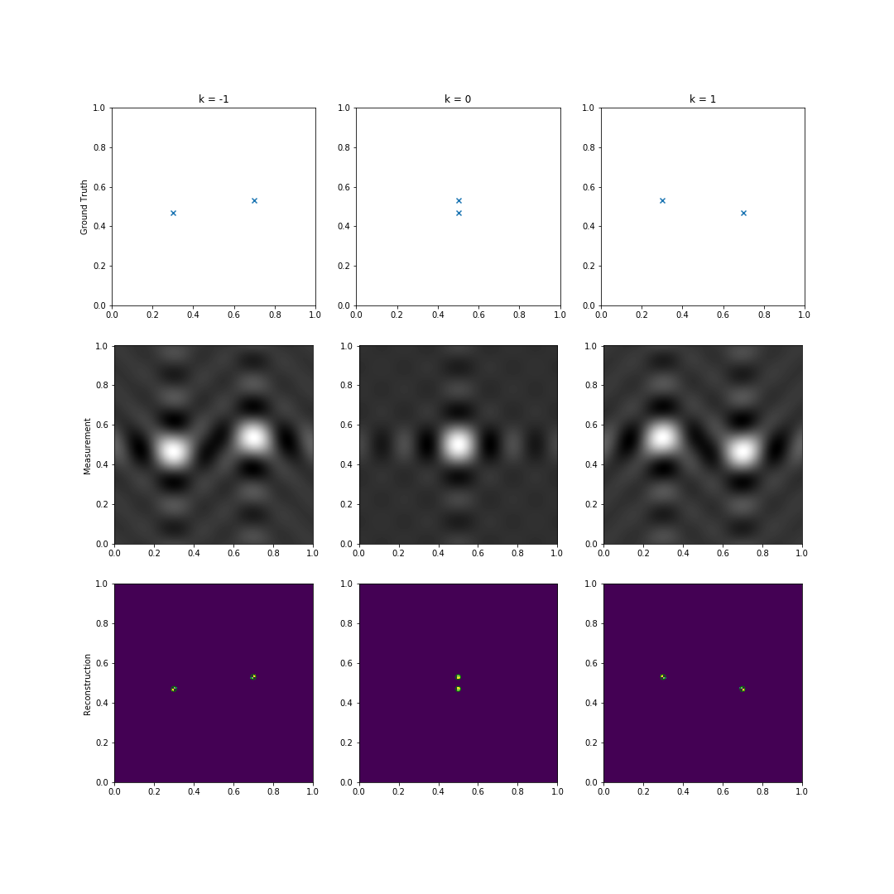

# SuperMoPS - **Super**-resolution of **Mo**ving **P**oint **S**ources 

## Features
- Can use any convex optimization solver
- Fuses information from multiple time steps 
- Uses a dimension reduction technique for faster solving
- Can optionally reconstruct velocities

## Installation

### Requirements
- Python 3 with numpy, scipy, matplotlib, scikit-learn
- [CVXOPT](https://cvxopt.org/install/index.html)
- [MOSEK](https://www.mosek.com/downloads/)

## Usage

Modify `example.py` and run
```
python example.py
```
or try the notebook `tutorial.ipynb` 

## Example


